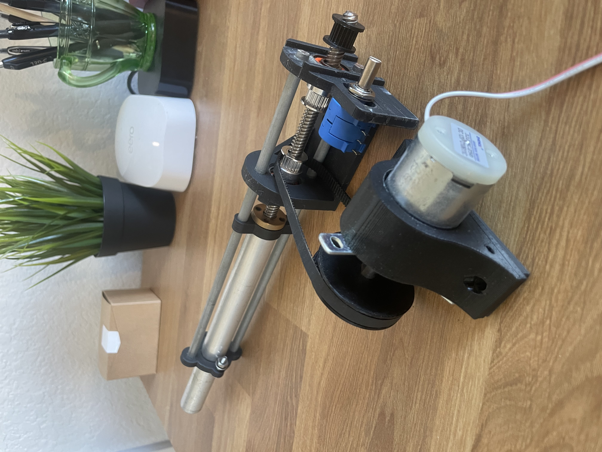

### Introduction 

&nbsp;&nbsp;&nbsp;&nbsp;&nbsp;&nbsp;&nbsp;&nbsp;This project is a 3d modeled linear actuator which uses a ten turn pot as a position encoder. This is a smaller part of a larger project, which is a sailboat autotiller. The sailboat autotiller stears a sailboat by pushing or pulling a tiller connected to a rudder. The amount that is pushed or pulled is controlled by a PID controller off of the sailboats attitude, which is sensed via the BNO055 IMU sensor from Bosch. 

&nbsp;&nbsp;&nbsp;&nbsp;&nbsp;&nbsp;&nbsp;&nbsp;Progress for this project slowed because of delays in getting the BNO055 properly working one the new microcontroller I've been using (STM32 Nucleo dev board), and because faulty milti-turn potentiometers (which I heard is common with cheap ones). That being said this project is continuing because of the now working STM32-BNO055 combination! BNO055 and STM32 repo can be found

    [Here](https://github.com/dkrygsman/drone_imu 'Here')

    [GitHub repo with stl files and parts](https://github.com/dkrygsman/linear_actuator 'Here')

    
 Linear Actuator 

