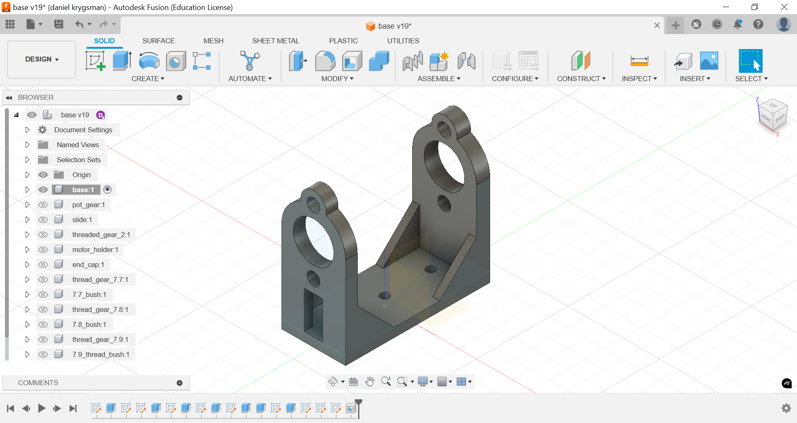

### Introduction 

&nbsp;&nbsp;&nbsp;&nbsp;&nbsp;&nbsp;&nbsp;&nbsp;This project is a PID controlled autotiller which depending on a sailboats yaw attitude or horizontal heading, pushes or pulls the boats tiller (which controls stearing) to correct its course. The project consists of a 3d modeled linear actuator which uses a ten turn pot as a position encoder, controlled by a one axis PID controller running on a STM32 Nucleo microcontroller programmed on STM32 Cube IDE. I am using the BNO055 IMU breakout board fron adafruit and an open source library from Daniel Mironow. 

### Linear Actuator 

&nbsp;&nbsp;&nbsp;&nbsp;&nbsp;&nbsp;&nbsp;&nbsp;The linear actuator was designed based off slide potentiometer linear actuator where the position is encoded with a slide pot, but with a ten turn potentiometer for encoding which can be belt driven. The body and some of the gears were modeled on fusion 360 and 3d printed on an Ender V3 and Bambu Labs A1 3d printers. The threaded rod (like one used for 3d printers) is installed through two bearings for decreased friction. The motor is also held by a 3d modeled and printed base and drives the threaded rod via 3d printer timing belts. The model took multiple iterations to get to where it is now, with changes improving it's action. 

    
 Linear Actuator First Design  

    
 Linear Actuator Final Design  

    
 Linear Actuator set up with parts and belts

&nbsp;&nbsp;&nbsp;&nbsp;&nbsp;&nbsp;&nbsp;&nbsp;Pictures and demo video to come once enclosure is made and PID controller code and push pull h-bridge functions are combined.

### Code

&nbsp;&nbsp;&nbsp;&nbsp;&nbsp;&nbsp;&nbsp;&nbsp;The linear actuators code was developed on the STM32 Nucleo f411re development board and the STM32 Cube IDE. There are two source files in the Github repo right now, push_pull which just consists of functions needed to controlled the pushing and pulling of the arm. The main function linear_set() is a three state state machine which its states are chill, push, and pull. This function outputs to two GPIO pins which connect to the H-bridge. The function also reads a target value, and pot value (from the ten turn pot for feedback).  

&nbsp;&nbsp;&nbsp;&nbsp;&nbsp;&nbsp;&nbsp;&nbsp;The second project in the repo is line_act, which consists of the single axis (Yaw) PID controller. The project is configured to have 3 analog inputs for potentiometers to set the k_p, k_i, and k_d constants, two I2C connections, one for the BNO055 IMU and one for an OLED screen displaying the constants, and a timer to output a PWM signal to a servo. The servo is temporary, and will be changed to work with the push pull project once the physical linear actuators enclosure is made. 
 
&nbsp;&nbsp;&nbsp;&nbsp;&nbsp;&nbsp;&nbsp;&nbsp;All stl files and code and a list of parts i boughtare included in repo below. 

    [Github Repo](https://github.com/dkrygsman/autotiller/tree/main 'Here')

