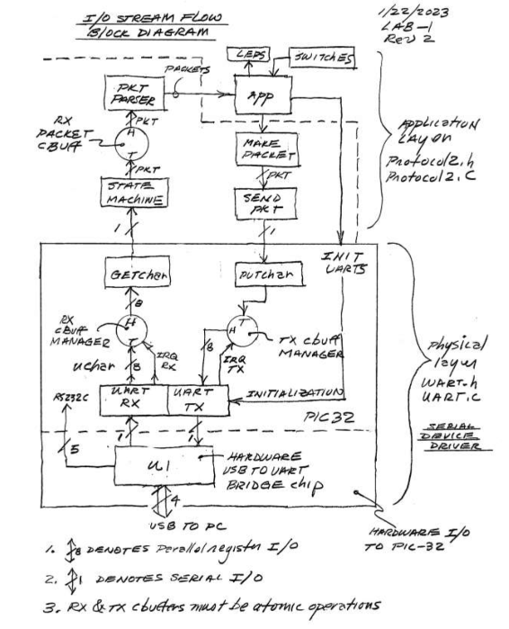

### Introduction 

&nbsp;&nbsp;&nbsp;&nbsp;&nbsp;&nbsp;&nbsp;&nbsp;For UC Santa Cruz's Electrical Engineering program, a concentration of communication signals and systems, or electronics and optics must be chosen and a respective design elective based of the concentration. I chose electronics and optics with the design elective ECE 121, Microcontroller System Design. The final project for this course was to create a uart driver for the PIC32 microcontroller. This involved understanding the hardware architecture of the PIC32 and understanding how to interpret the family reference manual to design a uart driver that interfaces properly to the hardware, parses the data into packages, and returns the package based on its message ID. This is done on the ChipKit uno32 development board by diligent, coded and debugged using MPLab X IDE. 


### Block Diagram 

&nbsp;&nbsp;&nbsp;&nbsp;&nbsp;&nbsp;&nbsp;&nbsp;The project can be broken up into two distinct layers, the physical layer, and the application layer. Diagram is featured below, and detailed descritions for each layer follows. 

<p align="center">
    
    Uart Driver and Protocol Block Diagram
</p>

### Physical Layer 

&nbsp;&nbsp;&nbsp;&nbsp;&nbsp;&nbsp;&nbsp;&nbsp;The physical layer consists of the uart bridge chip and is uart rx and tx registers (hardware components), two instances of a circular buffer struct (rx and tx), and the Getchar and Putchar functions for adding or taking from the rx/tx buffers. As for the application layer, this consists of a serial protocol parser function that verifies and creates packages from the incomming characters (head, length, payload, tail, checksum, end). This is then passed to the application which based on various ID's remakes the package and sendings it back to the physical layer to be transmitted back out of the Uno32 development board. Without the special ID"s spesified by the assignment the uart driver application layer just sends the packet as is back to the transmit side, if the package starts with the Debug ID, then it returns the date and time. If the package starts with the Ping ID then the ID is changed to Pong and the rest of the message (payload) is converted from big endian to little endian and returned. The last two ID cases are the Set and Get ID's which based off the rest of the message (payload) sets or gets the status of lit LEDS on the board. 

&nbsp;&nbsp;&nbsp;&nbsp;&nbsp;&nbsp;&nbsp;&nbsp;The heart of the application layer is the UartInit funtion and the interupt service routine (ISR) function which trigger the ISR depending on the status of the hardware registers. The code for the Init function and ISR are featured below, while the rest of the code is included in the github repo.
<p align="center">
    [Github Repo](https://github.com/dkrygsman/PIC32-uart-driver 'github repo')
</p>

```js {2} showLineNumbers
void Uart_Init(void){
    IEC0bits.U1RXIE = 0;
    IEC0bits.U1TXIE = 0;    
    U1MODE = 0;                     //clears control registers
    U1BRG = 21;                     //sets baud rate to generate 115200
    U1MODEbits.PDSEL = 00;          //sets no parity       
    U1MODEbits.STSEL = 0;           //sets 1 bit stop             //uart enable
            //receiver enable
    IPC6bits.U1IP = 6;
    IPC6bits.U1IS = 0;
    U1STAbits.URXISEL = 0;              //rx flag raised when character is received
    U1STAbits.UTXISEL = 0;              //tx flag raised when tx contains space
    IFS0bits.U1TXIF = 0;
    IFS0bits.U1RXIF = 0;
    U1MODEbits.ON = 1; 
    IEC0bits.U1RXIE = 1;
    IEC0bits.U1TXIE = 1; 
    U1STAbits.UTXEN = 1;            //transmitter enable
    U1STAbits.URXEN = 1;
    return;
}


void __ISR(_UART_1_VECTOR)IntUart1Handler(void)
{
    int checker = 0;
    if(IFS0bits.U1RXIF)                                     //RX block
    {
        IFS0bits.U1RXIF = 0;                //URXDA is rx buffer sweet stop
        while(U1STAbits.URXDA && !is_buff_full(&rx_buffer))     //has room and data and buffer has room
        {
            add_to_buff(&rx_buffer, U1RXREG);               //add rxREG contents to rx_buff
            //LATE = 0b00000001;
        }
    }
    if(IFS0bits.U1TXIF)                         //TX block
    {
        IFS0bits.U1TXIF = 0;
        if(tx_busy)                             //if busy do nothing
        {
            //tx_collision = 1;
            //LATE = 0b00000010;
            //tx_busy = 0;
        }
        else                                                            
        {
            while (!is_buff_empty(&tx_buffer) && !U1STAbits.UTXBF)      //if not busy check if tx_buff has data and TX is not full
            {                   //UTXBF is 1 when TX is full
                unsigned char val;
                val = take_from_buff(&tx_buffer);           //print next char from tx_buffer
                U1TXREG = val;
                //LATE = 0b00000100;
                //tx_busy = 0;
            } 
        }
    }
    //tx_busy = 0;
    IFS0bits.U1TXIF = 0;                            //lower flag for special cases such as first flag raise
}
```

### Physical layer 

&nbsp;&nbsp;&nbsp;&nbsp;&nbsp;&nbsp;&nbsp;&nbsp;The


