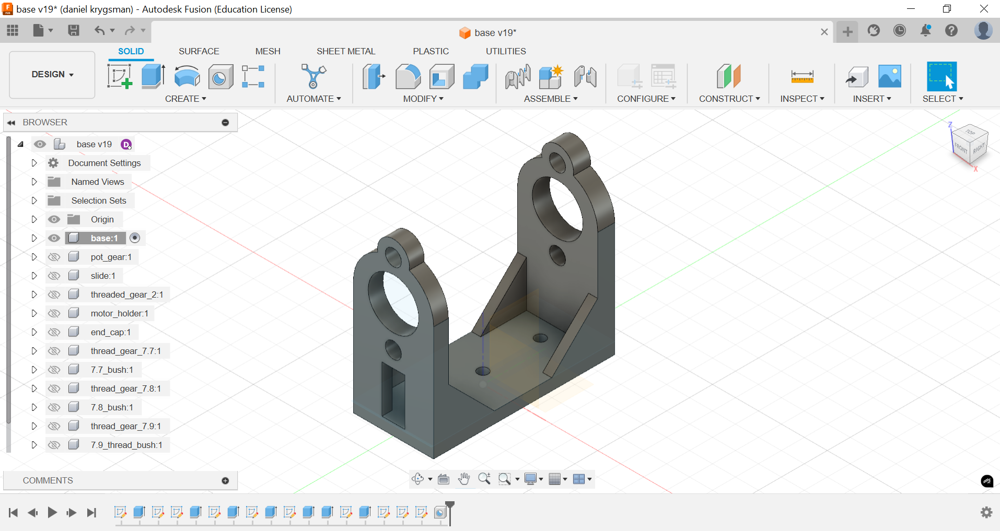
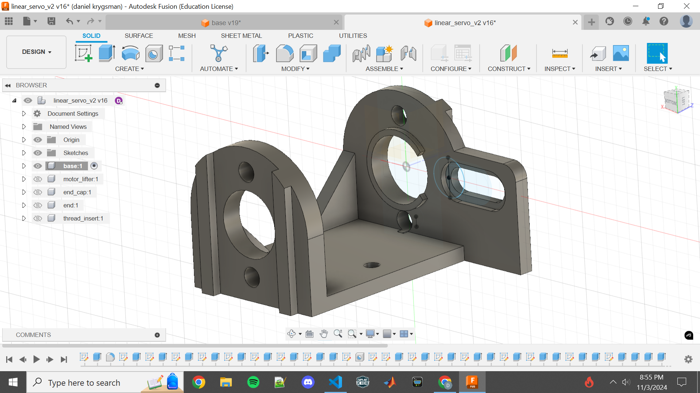
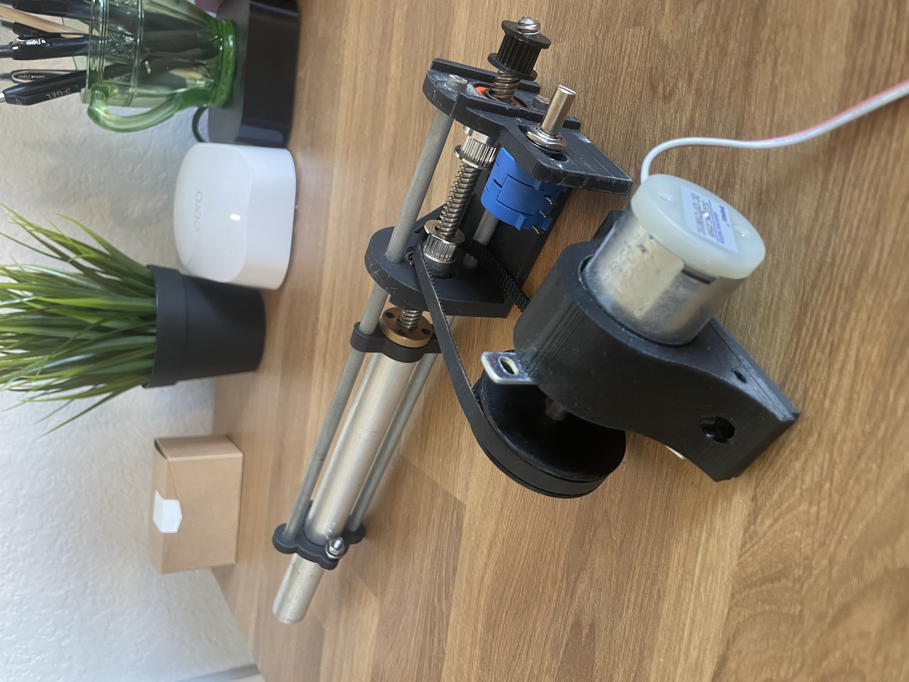
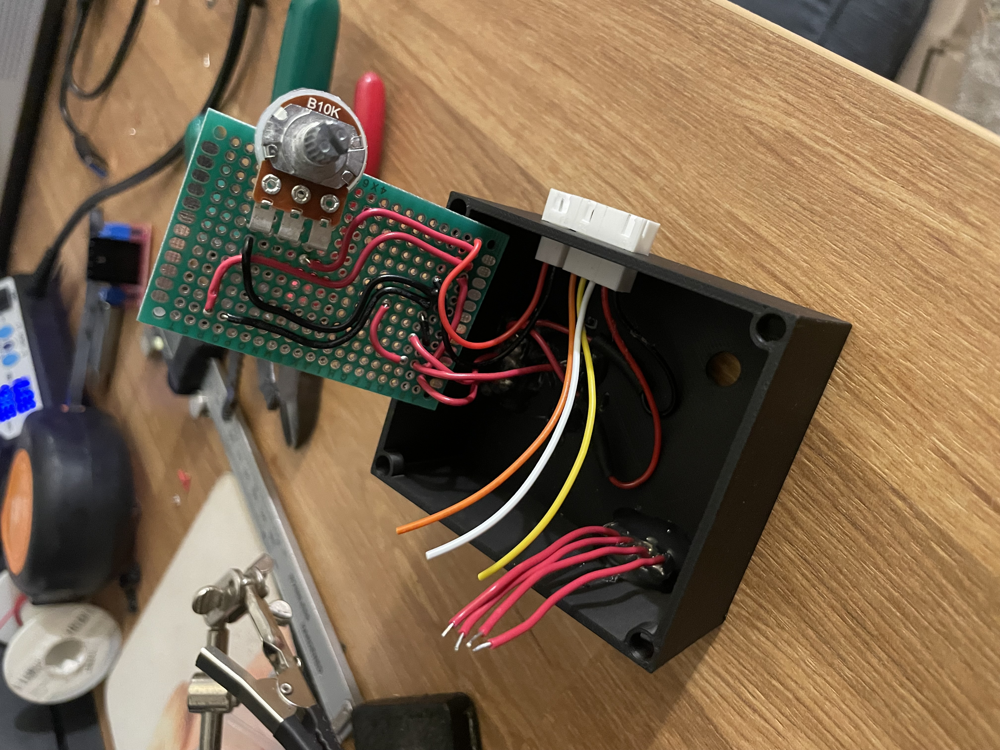
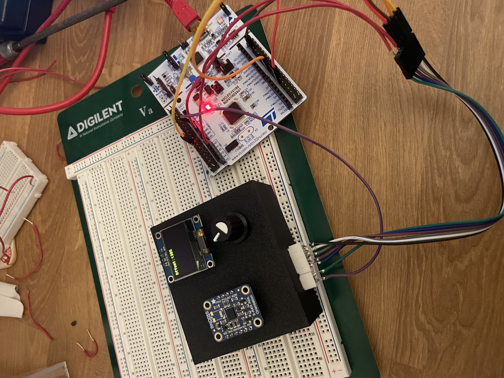
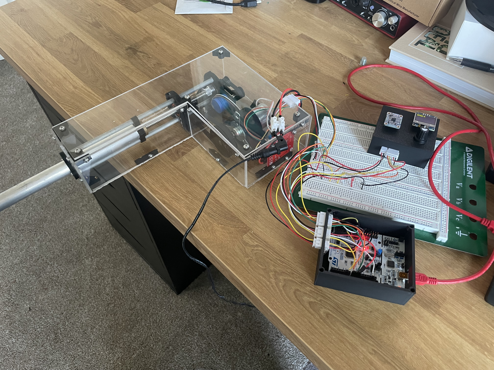
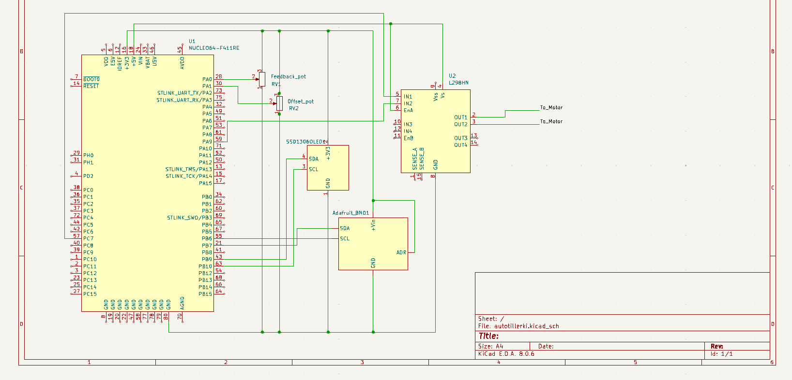

 ### Introduction 

&nbsp;&nbsp;&nbsp;&nbsp;&nbsp;&nbsp;&nbsp;&nbsp;This project is my most extensive dive into feedback control, in this case, based on attitude via a 9-DOF fusion IMU. I have toyed around with the idea of a hardcoded drone flight controller, but with my interest in sailing and access to a small sailboat (19' west wight potter), this seemed like a natural first step. The autotiller is a PID-controlled feedback system that depending on a sailboat's yaw attitude rotation, or horizontal heading, pushes or pulls the boat's tiller (which controls steering) to correct its course. The project consists of a 3d modeled linear actuator that uses a ten-turn pot as a position encoder, controlled by a one-axis PID controller running on an STM32 Nucleo microcontroller programmed on STM32 Cube IDE. I use the BNO055 IMU breakout board from Adafruit and an open-source library from Daniel Mironow. 

### Linear Actuator 

&nbsp;&nbsp;&nbsp;&nbsp;&nbsp;&nbsp;&nbsp;&nbsp;The linear actuator was designed based on a slide potentiometer encoded linear actuator where the position is encoded with a slide pot, but with a ten turn potentiometer for encoding which can be belt driven. The body and some of the gears were modeled on Fusion 360 and 3d printed on an Ender V3 and Bambu Labs A1 3d printers. The threaded rod (like the ones used for 3d printers) is installed through two bearings for decreased friction. The motor is also held by a 3d modeled and printed base and drives the threaded rod via 3d printer timing belts. The model took multiple iterations to get to where it is now, with changes improving its action. 

<p align="center">
    
    Linear Actuator First Design 
</p>

<p align="center">
    
    Linear Actuator Final Design 
</p>

<p align="center">
    
    Linear Actuator set up with parts and belts
</p>

&nbsp;&nbsp;&nbsp;&nbsp;&nbsp;&nbsp;&nbsp;&nbsp;All 3D modeled components are included in the github repo mentioned at the end of this article in the stl files folder.

### Code

&nbsp;&nbsp;&nbsp;&nbsp;&nbsp;&nbsp;&nbsp;&nbsp;The linear actuators code was developed on the STM32 Nucleo f411re development board and the STM32 Cube IDE. The project was initially made as two separate parts, push-pull which just consists of functions needed to control the pushing and pulling of the arm, and line_act which consists of the PID controller. The main function in the push-pull project is linear_set() is a three-state state machine whose states are chill, push, and pull. This function outputs to two GPIO pins which connect to the H-bridge. The function sets these pins based on a target value, and pot value (from the ten-turn pot for feedback). 

&nbsp;&nbsp;&nbsp;&nbsp;&nbsp;&nbsp;&nbsp;&nbsp;The second project, line_act, consists of the single axis (Yaw) PID controller. The project was developed using 3 analog inputs for potentiometers to set the k_p, k_i, and k_d constants, but later set as constants when combined with the push-pull functions. I also configured two I2C connections, one for the BNO055 IMU one for an OLED screen for displaying values, and a timer to output a PWM signal to a servo. The servo was temporary and was only used to tune the PID controller and find the optimum k_p, k_i, and k_d constants. 

```js showLineNumbers
	  bno.euler(&bno, &eul);			
	  yaw = (int)eul.yaw;				//populate yaw with euler.yaw value 
	  yaw = (yaw + 180) % 360;			//modulus for setting first value to 180 instead of 0 
	  new_yaw = yaw + offset_pot;		//shifting the heading based off offset

	  heading_set_point = 180;

	  heading = new_yaw;
	  heading_error = heading_set_point - heading;
	  PID_p = kp * heading_error;						//proportional component

	  heading_difference = heading_error - heading_prev_error;
	  PID_d = kd * ((heading_error - heading_prev_error)/ period);		//derivative component

	  if(heading_error > -3 && heading_error < 3)           //integral cutoffs 
	  {
		  PID_i = PID_i + (ki * heading_error);				//integral component 
	  }
	  else
	  {
		  PID_i = 0;
	  }

	  PID_total = PID_p + PID_i + PID_d;		//combining P, I, and D components 


    //	  printf("%f  %f  %f  %f  %f\r\n", PID_p, PID_i, PID_d, PID_total, heading_error);
    //	  fflush(stdout);
    //	  HAL_Delay(2);

    //	  printf("%f\t", PID_total);
    //	  fflush(stdout);
    //	  HAL_Delay(2);

	  PID_total = remap_val(PID_total, -3000, 3000, -400, 1600); 		//remapping values for range and sensitivity 
	  feedback_pot = remap_val(feedback_pot, 0, 4100, 101, 1099);	//limits set at 130 and 1070

	  if(PID_total < -200)			//PID limits 
	  {
		  PID_total = -200;
	  }
	  if(PID_total > 1400)
	  {
		  PID_total = 1400;
      }

    //	  printf("%f\r\n", PID_total);
    //	  fflush(stdout);
    //	  HAL_Delay(2);

	  linear_set(feedback_pot, GPIOC, GPIO_PIN_7, GPIOA, GPIO_PIN_9, PID_total);
```

&nbsp;&nbsp;&nbsp;&nbsp;&nbsp;&nbsp;&nbsp;&nbsp;With both separate projects coded and adequately tested, they are combined in the autotiller project. The final project included 2 analog inputs for the feedback (ten-turn) pot and the offset pot. Two I2C connections for the BNO055 IMU and the OLED displaying the yaw or heading, and the offset value. Lastly, the project included two GPIO output pins for driving the motor via the H-bridge. The offset is added because of the nature of sailing, when under wind power, a sailboat has forces such as the wind pushing the sail and the displacing or cutting force of the keel and water. These forces make the equilibrium of the tiller position a little off-center to keep course. Working on the project in two different parts and then combining them allowed for some abstraction that helped with development. 

### Enclosure

&nbsp;&nbsp;&nbsp;&nbsp;&nbsp;&nbsp;&nbsp;&nbsp;This project is eventually going to be tested on a sailboat and must be properly enclosed and powered. I developed a plexiglass case for the linear actuator (clear plexiglass to show off my design) with all brackets 3d printed and strengthened with 3M threaded inserts. I also 3D modeled enclosures for the STM32 and the sensor, offset pot, and OLED. The BNO055 breakout board and OLED are held in with female header pins for easy removal. All power and data pins are connected via JST connectors. 

<p align="center">
    
    Sensor Enclosure Wiring
</p>

<p align="center">
    
    Sensor Enclosure
</p>

<p align="center">
    
    All Enclosures 
</p>

<p align="center">
    
    Autotiller Schematic
</p>

<p align="center">
    [Autotiller Github Repo](https://github.com/dkrygsman/autotiller/tree/main 'Here')
</p>

&nbsp;&nbsp;&nbsp;&nbsp;&nbsp;&nbsp;&nbsp;&nbsp;All 3D modeled enclosures are included in the github repo mentioned at the end of this article in the stl files folder.

### Demo Video 

<p align="center">
    <iframe width="560" height="315" src="https://www.youtube.com/embed/PVOkc-hKHws?si=4ktpcWYo6CJpGAen" title="YouTube video player" frameborder="0" allow="accelerometer; autoplay; clipboard-write; encrypted-media; gyroscope; picture-in-picture; web-share" referrerpolicy="strict-origin-when-cross-origin" allowfullscreen></iframe> 
    PID Controlled Autotiller Demo Video 
</p>

### Future Plans

&nbsp;&nbsp;&nbsp;&nbsp;&nbsp;&nbsp;&nbsp;&nbsp;The autotiller is still yet to be tested on the sailboat. The k_p, k_i, and k_d constants have been already tuned but depending on its responsiveness can be updated. The most imporant change I plan on doing is changing out the motor for one with a higher rpm value, as the speed of the motor and thus actuator is the largest factor for responsiveness of the feedback system. A quicker motor would also for the non-on/off system to be more effective. The PID system has quick changes with a sudden yaw change and slower changes which "fine tune" the heading of the boat. This was more observeable when tuning the controller using a servo unlike the slow motored actuator. Another important topic to discuss is a sailboat moving through small waves can cause rocking motions which can affect the controller readings. I plan on utilizing a moving average on the yaw values to minimize the errors they might cause. 
