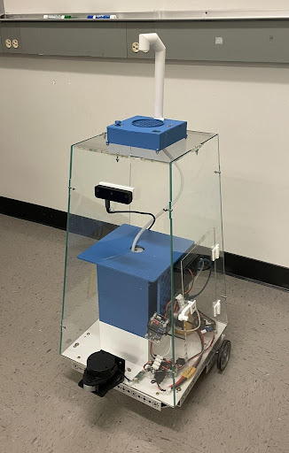

 
 ### Introduction 

 &nbsp;&nbsp;&nbsp;&nbsp;&nbsp;&nbsp;&nbsp;&nbsp;UCSC's Electrical or Robotic Engineering B.S. degrees need to complete a senior exit reqirememt either a thesis or a capstone project. Without already being involved in a research lab and not having a topic to write a thesis about, the capstone project is the more common option. The capstone series consists of three quarters so en entire school year, not counting the summer quarter. The format of the series involves the first quarter being for research and understanding the appropriate ways to conduct standardized engineering, settling on a project, and assembling a team, while the other two quarters are for prototyping, testing, and presenting. Royce Shoi, Gonzalo Tiscarero, Isabella Almarez, and myself made up the beverage service robot team and our goal was to develope a low cost autonomously navigating robot for resturaunt beverage service. The break up of this project was Royce taking responsibility of the mechanical role, building the chassis and bot shell, Gonzalo responsible of power, such as desgining a power regulator and overall system for our needs, Isabella in responsible for electrical, such as testing and interfacing sensors, and myself responsible for software. For the sake of relivance, I will only be discussing my specific work for the project and only explain their work for context of my role.

 ### Software Archietecture 

 &nbsp;&nbsp;&nbsp;&nbsp;&nbsp;&nbsp;&nbsp;&nbsp;Based off the project goals which will heavily require mapping and navigating in complex and changing envirements, we chose to use ROS2. We are running an onboard Raspberry Pi, and offboard laptop. We used the newest distribution at the time, ROS2 Iron, running on Ubuntu 22.04 jammy. ROS is appealing to projects like ours because it splits a complex robot up into "nodes". These nodes add a level of abstraction which is favorable in larger robotic projects. At the start of this project, we underestimated the learning curve needed to work with ROS2 and because of this sevearly underestimated the size of my specific role, software. 

### URDF 

&nbsp;&nbsp;&nbsp;&nbsp;&nbsp;&nbsp;&nbsp;&nbsp;The ROS archetecture uses a URDF or robot description file to tie all sensing and moving parts of the robot together and all bodies of the robot for mapping. This intensive process consisted of matching precise measurements to create a body that matches our bot. ROS allows for importing STL files to give a exact shape which is something that can be utilized in the future or on other robotic projects. The moving bodies such as drive wheels and caster wheel are specified as non-fixed bodies and all bodies of the bot also have their respective moments of interia, resistance, weight which add to map to real world accuracy when testing. Bodies are also made for the sensors with respective "frames" which give the system information on where the origin of sensor data lies. Below are images for URDF file visualized and actual bot. 

### ROS2 Control

&nbsp;&nbsp;&nbsp;&nbsp;&nbsp;&nbsp;&nbsp;&nbsp;By far the largest part of my role of the project was interfacing the motors with the system. The ROS standard for interfacing motors is setting up a ROS Control node which sets all system read and write as state and command interfaces instead of using topics and actions. This is to done to decrease latency. Another aspect of the motor control was to use a seperate microcontroller to conduct all low level computation while the Pi only controls the command to each wheel and the position and velocity of each wheel. This follows the trend of adding levels of abstraction to the system. The offboard microcontroller used is an Arduino Nano running a differential drive controller code provided by a bay area robotics club, Homebrew Robotics Club.\
&nbsp;&nbsp;&nbsp;&nbsp;&nbsp;&nbsp;&nbsp;&nbsp;The ROS control node is built off the supplied demos from the ROS Control documentation, but changed to work with the specific motor controller microcontrollers code. This entailes when and what data must be passsed via the serial connection. Our bot uses two PID controlled motors along with GoBilda Yellow Jacket Planetary motors with encoders because of the speed, torque, and price specs. The heart of the ROS Control node is a C++ program, which runs through states setting up its read and write functions to the motor controller. With all of this working our bot can accurately and quickly control the fairly high torque motors needed for this project. Setting up the ROS Control node became the largest part of the software role because even with good documentation, the specific nature ROS and much more specific ROS Control, debugging seemed like a Stack Overflow tresure hunt.     

### Sensors

&nbsp;&nbsp;&nbsp;&nbsp;&nbsp;&nbsp;&nbsp;&nbsp;Unlike the ROS Control node, the sensors were much easier then expected. Both the RPLidar and distance camera are supported to be used with ROS, each come with necessary dependencies and packages, and documentation to run provided launch files depending on the application. Both sensors were easy to configure and did not prove to be anny issue when integrating with the rest of the system during SLAM. The 2d Lidar proved to be the favorite sensor due to its accuracy and easy of use with navigation, and I look forward to potentially working with a 3d lidar unit in my future. 

### SLAM

&nbsp;&nbsp;&nbsp;&nbsp;&nbsp;&nbsp;&nbsp;&nbsp;With all aspects of the bot complete this left mapping, localization, and navigation. This was done using ROS2's slam toolbox and Navigation stack. The specific localization used was Adaptive Monte Carlo Localization. A joystick node was also added to provide smoother mapping as apposed to keyboard teleoperation. Mapping was able to be done manually for various locations, for example my college house's kitchen featured in the demo videos, and saved to use with localization and navigation. Also featured in the demo videos below is us using waypoint follower and object detection. Project time constraints forced us to stop there, but further work with the various capabilities of NAV2 is planned for the future including the implementation of behavior trees. 

<iframe width="560" height="315" src="https://www.youtube.com/embed/lwT7Ji5HInI?si=QkOwBkVjadYjS7vc" title="YouTube video player" frameborder="0" allow="accelerometer; autoplay; clipboard-write; encrypted-media; gyroscope; picture-in-picture; web-share" referrerpolicy="strict-origin-when-cross-origin" allowfullscreen></iframe>

 <iframe width="560" height="315" src="https://www.youtube.com/embed/u3F0A-JTb20?si=F2U2-iHD55ZZtkCJ" title="YouTube video player" frameborder="0" allow="accelerometer; autoplay; clipboard-write; encrypted-media; gyroscope; picture-in-picture; web-share" referrerpolicy="strict-origin-when-cross-origin" allowfullscreen ></iframe> 

