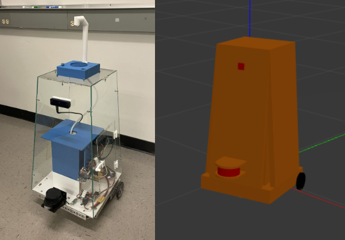
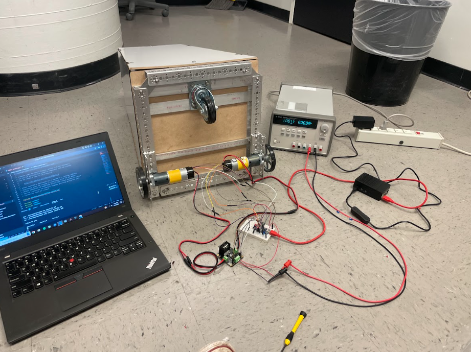
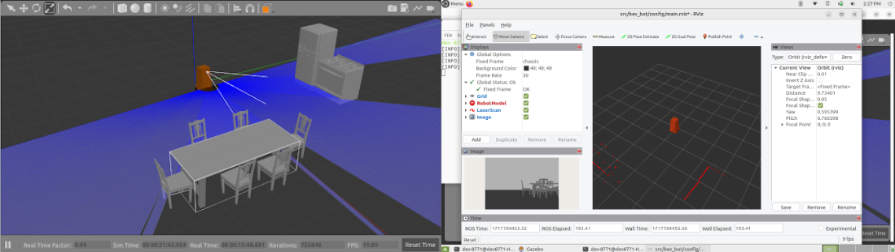
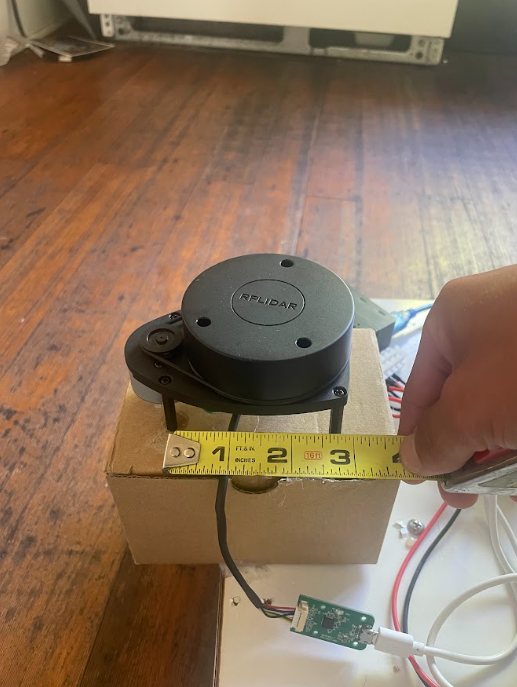
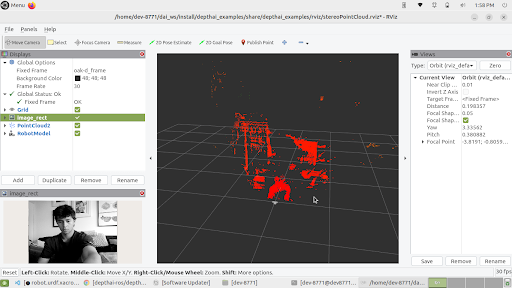

 
 ### Introduction 

 &nbsp;&nbsp;&nbsp;&nbsp;&nbsp;&nbsp;&nbsp;&nbsp;UCSC's Electrical or Robotic Engineering B.S. degrees need to complete a senior exit requirement either a thesis or a Capstone Project. The Capstone Project is a year-long year-long project where students gather teams, propose a project, design, implement, and present their progress.\
&nbsp;&nbsp;&nbsp;&nbsp;&nbsp;&nbsp;&nbsp;&nbsp;The Beverage Service Robot team consisted of Royce Shoi, Gonzalo Tiscarero, Isabella Almarez, and myself, and our goals were to develop a low-cost autonomous robot for use in restaurants. Our design consisted of a differential drive bot with a 2d Lidar sensor, and a distance camera running the ROS software architecture for mapping, localization, obstacle avoidance, and navigation. The project is split up into technical roles, and meet twice a week performing scrum meetings to track team progress. The break up of this project was Royce taking responsibility for the mechanical role, Gonzalo responsible for power, Isabella responsible for electricaltestng, and myself responsible for the software. For the sake of relevance, I will only be discussing my specific work for the project and only explain their work in the context of my role.

 ### Software Archietecture 

 &nbsp;&nbsp;&nbsp;&nbsp;&nbsp;&nbsp;&nbsp;&nbsp;Based on the project goals which will heavily require mapping and navigating in complex and changing environments, we chose to use ROS2. We are running an onboard Raspberry Pi, and offboard laptop. We used the newest distribution at the time, ROS2 Iron, running on Ubuntu 22.04 jammy. ROS is appealing to projects like ours because it splits a complex robot up into "nodes". These nodes add a level of abstraction which is favorable in larger robotic projects. At the start of this project, we underestimated the learning curve needed to work with ROS2 and severely underestimated the size of my specific role, software. 

### URDF 

&nbsp;&nbsp;&nbsp;&nbsp;&nbsp;&nbsp;&nbsp;&nbsp;The ROS architecture uses a URDF or robot description file to tie all sensing and moving parts of the robot together and all bodies of the robot for mapping. This intensive process consisted of matching precise measurements to create a body that matches our bot. ROS allows for importing STL files to give an exact shape which is something that can be utilized in the future or on other robotic projects. The moving bodies such as drive wheels and caster wheels are specified as non-fixed bodies and all bodies of the bot also have their respective moments of inertia, resistance, and weight which add to map to real-world accuracy when testing. Bodies are also made for the sensors with respective "frames" which give the system information on where the origin of sensor data lies. Below are images for the URDF file visualized and the actual bot. 

    
 Bot and corresponding URDF file model

### ROS2 Control

&nbsp;&nbsp;&nbsp;&nbsp;&nbsp;&nbsp;&nbsp;&nbsp;By far the largest part of my role in the project was interfacing the motors with the system. The ROS standard for interfacing motors is setting up a ROS Control node which sets all system read and write as state and command interfaces instead of using topics and actions. This is to be done to decrease latency. Another aspect of the motor control was to use a separate microcontroller to conduct all low-level computation while the Pi only controls the command to each wheel and the position and velocity of each wheel. This follows the trend of adding levels of abstraction to the system. The offboard microcontroller used is an Arduino Nano running a differential drive controller code provided by a Bay Area robotics club, Homebrew Robotics Club.\
&nbsp;&nbsp;&nbsp;&nbsp;&nbsp;&nbsp;&nbsp;&nbsp;The ROS control node is built off the supplied demos from the ROS Control documentation, but changed to work with the specific motor controller microcontrollers code. This entails when and what data must be passed via the serial connection. Our bot uses two PID-controlled motors along with GoBilda Yellow Jacket Planetary motors with encoders because of the speed, torque, and price specs. The heart of the ROS Control node is a C++ program, which runs through states setting up its read and write functions to the motor controller. With all of this working our bot can accurately and quickly control the fairly high torque motors needed for this project. Setting up the ROS Control node became the largest part of the software role because even with good documentation, the specific nature of ROS, and much more specific ROS Control, debugging seemed like a Stack Overflow treasure hunt.     

    
 ROS2 Control motor testing 

### Sensors

&nbsp;&nbsp;&nbsp;&nbsp;&nbsp;&nbsp;&nbsp;&nbsp;Unlike the ROS Control node, the sensors were much easier than expected. Both the RPLidar and distance camera are supported to be used with ROS, each comes with necessary dependencies and packages, and documentation to run provided launch files depending on the application. Both sensors were easy to configure and did not prove to be an issue when integrating with the rest of the system during SLAM. The 2d Lidar proved to be my favorite sensor due to its accuracy and ease of use with navigation, and I look forward to potentially working with a 3d lidar unit in the future. 

    
 Simulated lidar with visualized output 

    
 Actual 2D lidar sensor 

    
 OAK-D Lite depth camera output

### SLAM

&nbsp;&nbsp;&nbsp;&nbsp;&nbsp;&nbsp;&nbsp;&nbsp;With all aspects of the bot complete this left mapping, localization, and navigation. This was done using ROS2's slam toolbox and Navigation stack. The specific localization used was Adaptive Monte Carlo Localization. A joystick node was also added to provide smoother mapping as opposed to keyboard teleoperation. Mapping was able to be done manually for various locations, for example, my college house's kitchen featured in the demo videos and saved to use with localization and navigation. Also featured in the demo videos below is us using waypoint follower and object detection. Project time constraints forced us to stop there, but further work with the various capabilities of NAV2 is planned for the future including the implementation of behavior trees. 

    <iframe width="560" height="315" src="https://www.youtube.com/embed/lwT7Ji5HInI?si=QkOwBkVjadYjS7vc" title="YouTube video player" frameborder="0" allow="accelerometer; autoplay; clipboard-write; encrypted-media; gyroscope; picture-in-picture; web-share" referrerpolicy="strict-origin-when-cross-origin" allowfullscreen></iframe>
    Bot room mapping demo

    <iframe width="560" height="315" src="https://www.youtube.com/embed/u3F0A-JTb20?si=F2U2-iHD55ZZtkCJ" title="YouTube video player" frameborder="0" allow="accelerometer; autoplay; clipboard-write; encrypted-media; gyroscope; picture-in-picture; web-share" referrerpolicy="strict-origin-when-cross-origin" allowfullscreen ></iframe> 
    Bot navigation and object avoidance demo 

    [Final Report](https://github.com/dkrygsman/pi_ws/blob/main/Capstone%20Final%20Paper.pdf 'The best place on the internet')

