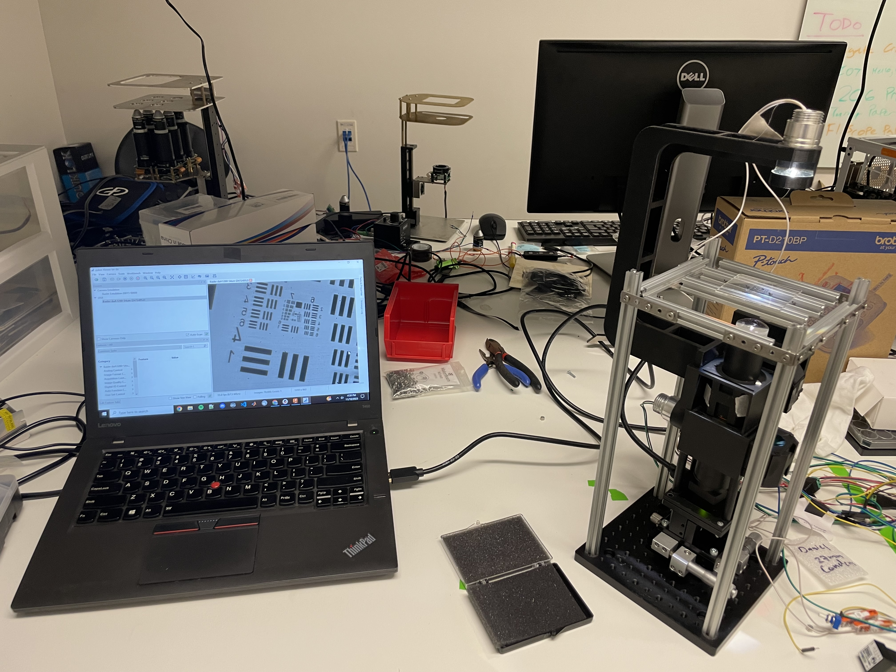

 ### Introduction 

&nbsp;&nbsp;&nbsp;&nbsp;&nbsp;&nbsp;&nbsp;&nbsp;The Cubiscope is a multi-channel calcium imaging microscope created by The UCSC Teodorescu Braingineers Lab for remote observation of lab grown brain organoids inside an incubator. I served as an undergradute researcher for PhD. student Nico Hawthorne and UCSC Prof. Mircea Teodorescu. This project and research was done in conjunction with the Genomics Institute of UCSC and the Molecular, Cellular, and Developmental Biology Department of UCSC. 

&nbsp;&nbsp;&nbsp;&nbsp;&nbsp;&nbsp;&nbsp;&nbsp;The multi-channel aspect of the microscope consisted of multiple wavelength excitation lights (568nm, 470nm), a field of view, and the ability to excite and record multiple channels at once. The different excitation lights are separated using dichroic mirrors and used to excite green fluorophores such as GFP and GCaMP6f and red-91 shifted fluorophores such as Texas Red and mScarlet. 

&nbsp;&nbsp;&nbsp;&nbsp;&nbsp;&nbsp;&nbsp;&nbsp;My specific work consisted of working with microscope optical parameters to design the brightfield light holder, and aiding in the Biology clean room with testing the microscope on live samples. 

    
    Testing Brightfield Design

    
    collecting GFP and GCaMP6f Data

&nbsp;&nbsp;&nbsp;&nbsp;&nbsp;&nbsp;&nbsp;&nbsp;The purpose of this lab is to develope a better, affordable microscope in the hopes to progress research for cell prcesses in cancer studies, drug discovery, and examining cellular composition. The funding for the lab comes from The National Human Genome Research Institute, Schmidt Futures, and DARPA. 

    
    Report Cover Page 

    
    Report Introduction

&nbsp;&nbsp;&nbsp;&nbsp;&nbsp;&nbsp;&nbsp;&nbsp;The Project is the Thesis report for Nico Hawthorne and has been submitted to Device Research Journal. A link to the full report will be attached when posted.