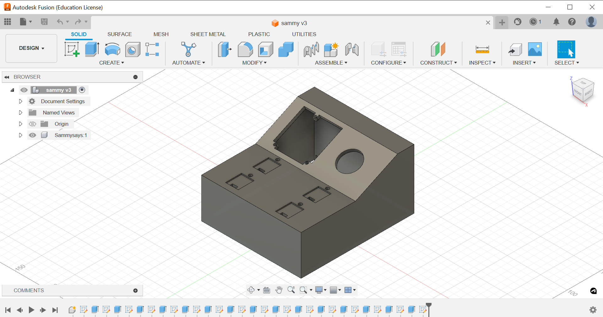

 

 ### Introduction 

 &nbsp;&nbsp;&nbsp;&nbsp;&nbsp;&nbsp;&nbsp;&nbsp;Sammy Says is a memory game made by classmate Teresa Begley and myself based off the game Simon by Hasbro. Sammy Says is a memory game where a sequence of lights and tones must be replicated as they incrementally get longer. Sammy Says is written in C and programmed on the STM 32 Nucleo microcontroller, uses four capacitive touch sensors as "buttons", and uses the TPA2005D1 audio amplifier. Sammy Says was done as the final project for UCSC's ECE 167 course, Sensors and Sensing Technology. 

 ### Code

&nbsp;&nbsp;&nbsp;&nbsp;&nbsp;&nbsp;&nbsp;&nbsp;ECE 167 was originally taught on the PIC32 microcontroller via the ChipKit Uno32 development board by Diligent, with the option to be done on the Nucleo. Because of this, this project was started on the PIC32 and finished on the STM32, both projects are included in the Git repo. The final project was finished using the STM32 and all content will be refering to it. We designed a six state state machine with states Chill, Prompt, Delay, Reading, Correct, and Incorrect. The states cycle through waiting for prompts, assigning variables, and transitioning to make a smooth playing game. The capacitive touch sensors are arranged with LM555 circuits to create period varrying oscillators. The capacitive touch sensors are then assigned as interrupts, uses a timers library to measure their periods, and uses moving average buffers for each sensor. Each sensor is tested to find their resting and touched values and these are set in software using SammyCaptouch_1IsTouched through SammyCaptouch_4IsTouched functions. 

    [Github Repo](https://github.com/dkrygsman/sammy_says/tree/main 'The best place on the internet')

 ### Case 

&nbsp;&nbsp;&nbsp;&nbsp;&nbsp;&nbsp;&nbsp;&nbsp;The case for Sammy Says was modeling in Fusion 360 and printed on an Ender 3. The base has areas for speaker, capcitive touch sensors, and mounting brackets for the STM32 nucleo and corresponding IO Sheild. 

    
    Case stl body

    [Sammy Says Report](https://github.com/dkrygsman/sammy_says/blob/main/sammy_says_report.pdf 'The best place on the internet')

 

    <iframe width="560" height="315" src="https://www.youtube.com/embed/u1V6D2-ba0U?si=Q8SEQNsNNddLhyP6" title="YouTube video player" frameborder="0" allow="accelerometer; autoplay; clipboard-write; encrypted-media; gyroscope; picture-in-picture; web-share" referrerpolicy="strict-origin-when-cross-origin" allowfullscreen></iframe>
    Sammy Says demo video

